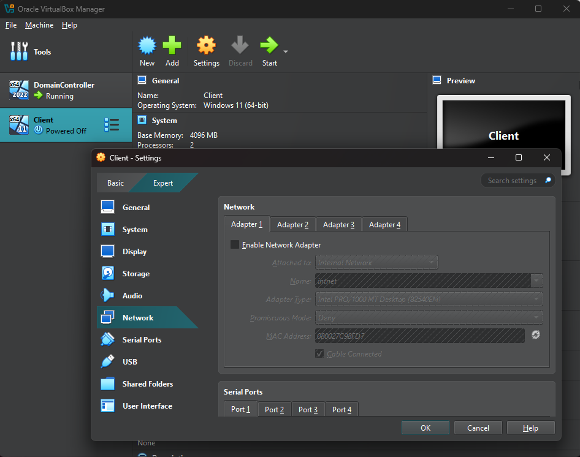
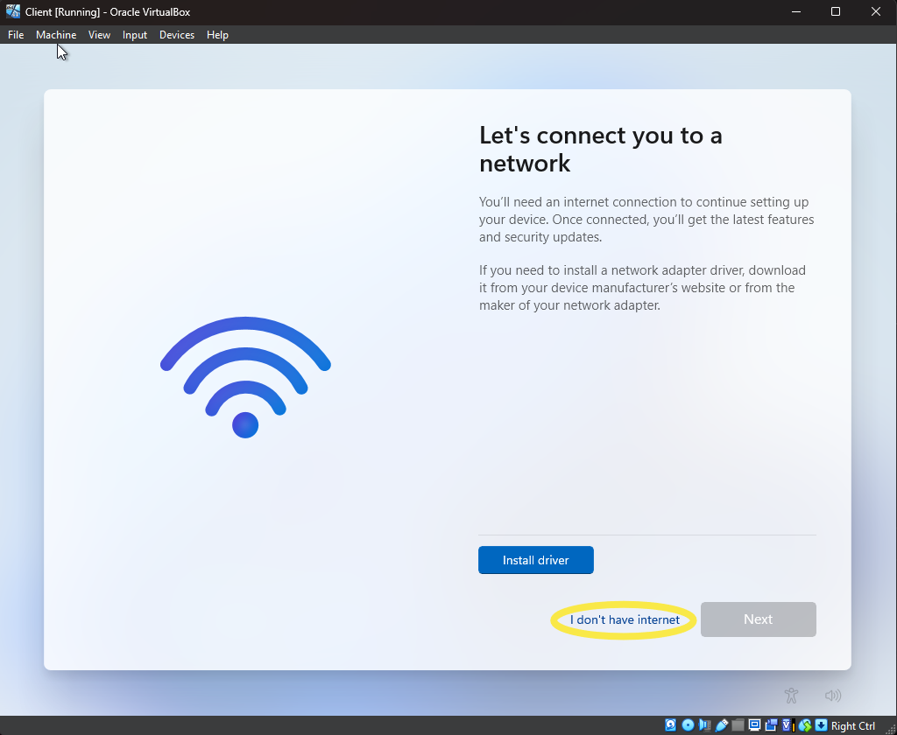
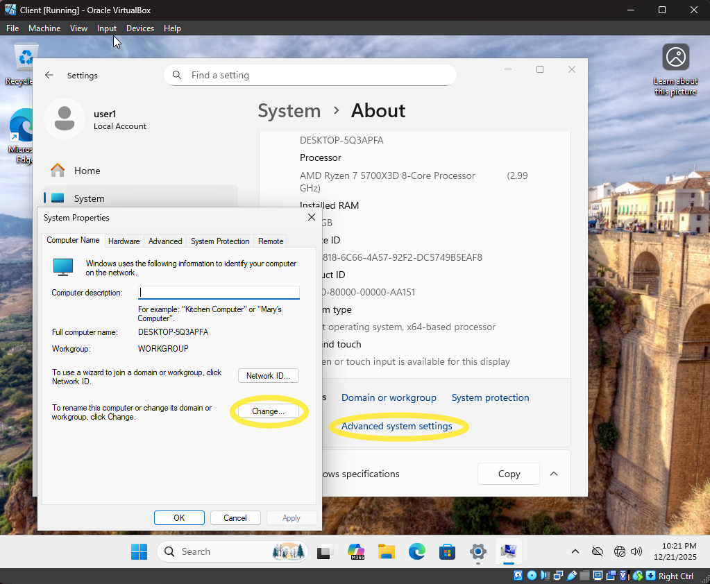
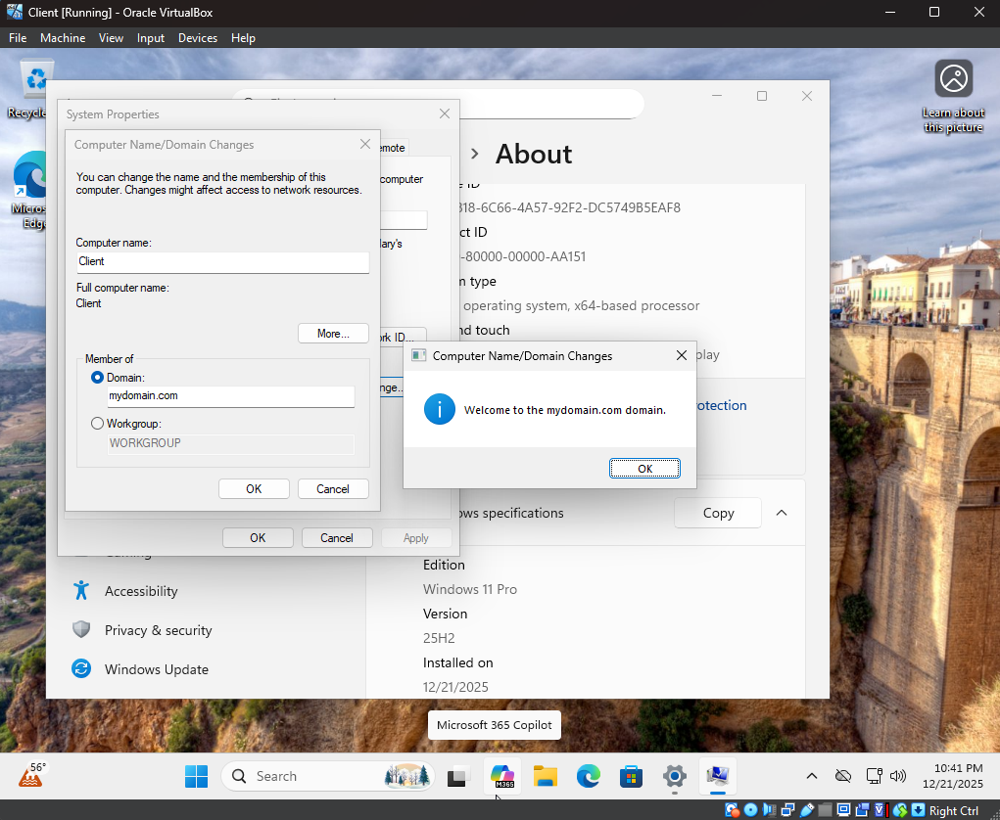
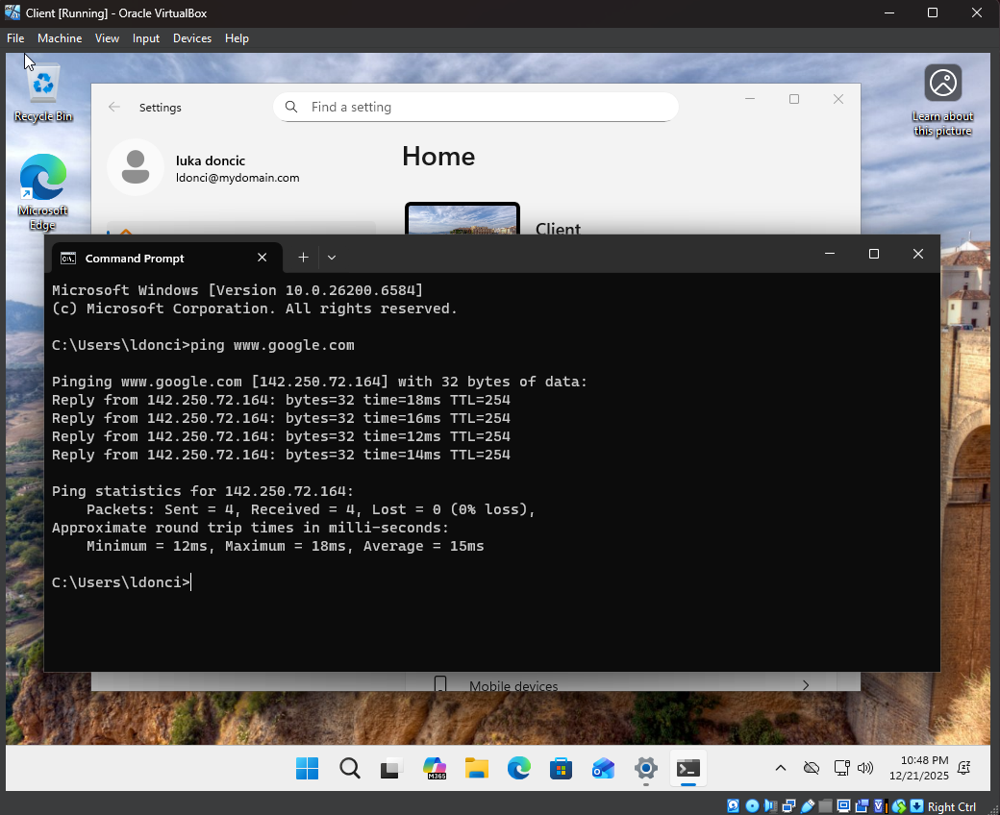
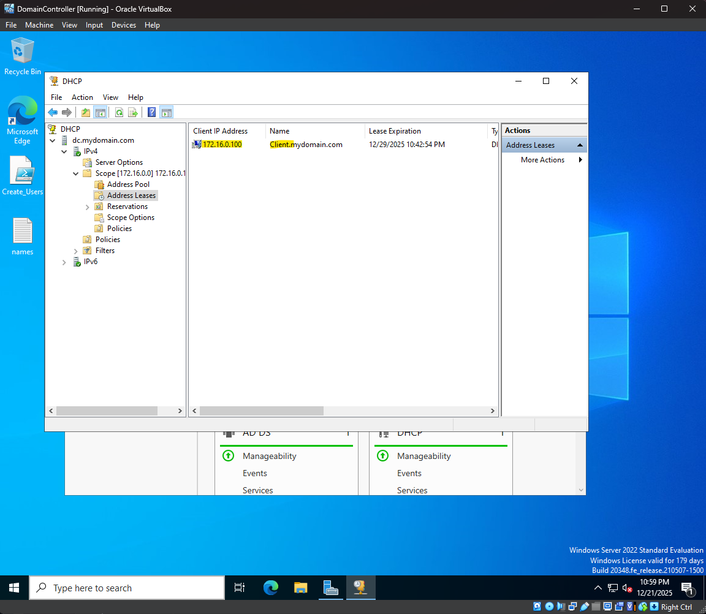

# Active Directory Home Lab

This home lab uses Oracle VirtualBox to deploy a Windows Server domain controller and a Windows client machine, with dual NICs configured for NAT and internal networking. Active Directory Domain Services, NAT/RAS, and DHCP are set up to create a new forest, manage organizational units, and provide network access for both internal and external connectivity. Optional Python and PowerShell scripts automate user creation and management, simulating enterprise Active Directory operations.
# Steps: 

**Step 1: Set up the domain controller VM**

To configure the domain controller virtual machine, first install Oracle VirtualBox and the respective disk images (ISOs) for [Windows Server 2022](https://www.microsoft.com/en-us/evalcenter/download-windows-server-2022) and [Windows 11](https://www.microsoft.com/en-us/software-download/windows11). Once installed, a new virtual machine can be configured and have resources provisioned from your host computer. For the domain controller 4 CPU cores and 4GB of RAM are dedicated to the VM, but these settings can be changed to accommodate your system hardware specifications. It will also require two network adapters: one for your internet and another for the internal network. 

- Click “New” -> ISO Image: “SERVER_EVAL_x64FRE_en-us.iso” -> Check “Skip Unattended Installation”
- Select “Settings” -> Select “Network” -> Adapter 1, Attached to: NAT -> Adapter 2, Attached to: Internal Network

**Step 2: Install and Configure Windows Server 2022**

Run the virtual machine and allow it to boot into the Microsoft Server Operating System Setup screen. This will bring you to language selection and a user agreement. Afterwards, select “Windows Server 2022 Standard Evaluation (Desktop Experience)” once you reach the OS install menu. Next select the unallocated partition and set administrator credentials. Once you’ve finished the installation and signed into the admin account enable guest additions. This allows you to have quality of life features like resizing the virtual machine window.

- Select “Devices” -> “Insert Guest Additions CD Image…” -> File Explorer: “CD Drive (D:)...” -> “Vbox Windows Additions-amd64” 
- In the installation wizard click next until the installation button appears -> Select manual reboot once installation is complete
 

After guest additions have been installed, proceed to identifying and renaming the network adapters. These should be renamed to differentiate between the internet and the internal network. The internal network can be identified by viewing properties and looking for an APIPA address (169.254.xxx.xxx). The internal network should have its IPv4 settings changed for address, subnet mask, and DNS. 

- Settings -> Network & Internet -> Ethernet -> “Change adapter options” -> Right-click adapter -> Status
- Change via “Properties” -> IP address: 172.16.0.1, Subnet Mask: 255.255.255.0, DNS server: 127.0.0.1

Lastly, rename the system to an appropriate system name i.e. DC1. This can be reached by going to: 
- Settings -> System -> About -> "Rename this PC" -> Select "restart now" 

**Step 3: Install and Configure Active Directory Services**

From the Server Manager window select "Add roles and features" -> select the domain controller -> select "Active Directory Domain Services" and "Add Features" -> select Next until the Install button appears. Once the installation is complete a warning sign will appear to finish the initial configuration. Select "Promote this server to a domain controller" -> Deployment Configuration: "Add a new forest" -> enter a domain name -> set a DSRM password -> Next until Install which will prompt a restart. This is done correctly when the next sign-in shows "MYDOMAIN\Administrator". 

**Step 4: Create an Admin Account**

From the Server Manager select Tools -> Active Directory Users and Computers -> right-click "mydomain.com" -> New -> Organizational Unit. Name the OU then uncheck the box for accidental deletion. While the OU folder is selected "Create a new user in the current container." -> enter a name and user logon name -> set a password and select never expire. This will then show a summary of the account where you can select "Finish". Next, right-click the account and select Properties -> Member Of -> Add... -> in "Select Groups" under the "Enter the object names to select" box enter "domain admins" and click "Check Names" -> "OK" -> "Apply". Now that the admin account has been created, sign-in using the new credentials. 

**Step 5: Configure NAT/RAS**

From Server Manager select Add Roles and Features -> select the desired domain controller -> in "Select server roles" check "Remote Access" -> click next until "Select role services" -> check the box for "Routing" and click "Add Features" in the new window -> next until Install option is available. Next go to "Tools" and select "Routing and Remote Access" -> right-click the domain controller and select "Configure and Enable..." -> select Network address translation (NAT) -> select "Use this public interface to connect to the internet" and make sure to select the home internet NIC to finish the configuration. A common issue is that the box will be blank, just close the window and retry the steps again or restart the VM. 

**Step 6: Configure DHCP**

Use Server Manager to add the DHCP Server role and complete the installation using the default settings similar to the other services. Open the DHCP management console via Tools, expand IPv4, and create a new scope with a range of 172.16.0.100-200, using a subnet mask of 255.255.255.0 -> NEW SCOPE -> Name: 172.16.0.100-200 -> Start IP address: 172.16.0.100 -> End IP address: 172.16.0.200 -> Length: 24. Leave exclusions, delays, and lease duration at their default values, then configure DHCP options by setting the default gateway (router) to 172.16.0.1 and leaving WINS settings unchanged. Activate the scope, authorize the DHCP server in Active Directory, and refresh the console to confirm the service is running.

**Step 7: Create Users Manually or via PowerShell/Python Scripts**

Similar to creating an administrative account, standard user accounts can be created manually through Active Directory Users and Computers by creating an organizational unit, disabling accidental deletion, and using the New User wizard to assign usernames and passwords. For scalability, this can be done via a PowerShell script. This script automates Active Directory user creation by reading first and last names from a text file and generating standardized usernames. It formats usernames using the first letter of the first name and up to five characters of the last name, then checks Active Directory for existing accounts and appends a number if duplicates are found. The script creates an organizational unit if it does not already exist and provisions each user with a preset password, non-expiring credentials, and automatic placement into the designated OU. The text file can also be generated using Python scripting. In the example shown below, Python was used to collect the names from all of the NBA rosters from the ESPN website. It then formats each name into a list for Active Directory use. To use the included PowerShell script from the desktop click on "Start" -> Windows PowerShell -> Windows PowerShell ISE -> right-click -> More -> "Run as administrator". Once it is open type "Set-Execution Policy Unrestricted" into the terminal and press enter. It will open a new window for the execution policy change -> select "Yes to All". The script can be used from the desktop with a names.txt file. 

**Step 8: Create a Windows 11 Pro VM**

Create the VM for the client in VirtualBox by clicking "New" -> select the Windows 11 ISO -> select "Skip Unattended Installation" -> assign appropriate CPU, RAM, and storage based on your system -> Set one network adapter and attach it to the Internal Network. Disable this adapter for now during the initial Windows 11 set up to bypass creating a microsoft account. Once the VM is launching press a button once prompted to use the ISO file. During the setup at the Product Key section select "I don't have a product key". Once at the language selection screen click on "Input" -> Keyboard -> Soft Keyboard... -> SHIFT + F10 -> Enter "OOBE\BYPASSNRO" into the command prompt. This will restart the VM and from the "Let's connect you to a network" screen allow you to select "I don't have internet". Once you reach the desktop using the local account, you can shut the VM down and enable the internal network adapter. 

**Step 9: Join the System to the Domain**

The final step will be to join the system to the domain via Settings -> System -> About -> Advanced System Settings -> Computer Name tab and selecting "Change...". This allows you to enter the desired domain and join to the internal network. Once joined to the domain it will prompt for the system to be restarted. Here you can join using one of the user credentials made through scripting or manual user creation. You can check if the system is routed correctly by pinging a well known website like google.com and verifying the DHCP lease in the domain controller concluding the homelab.

